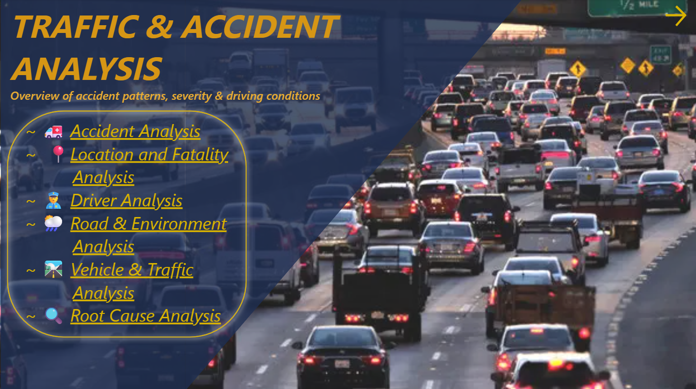
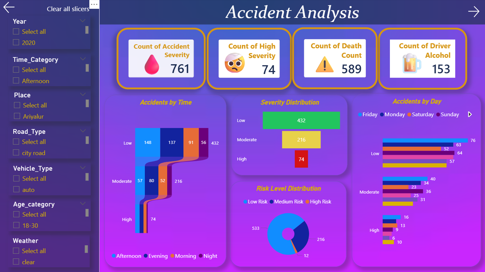
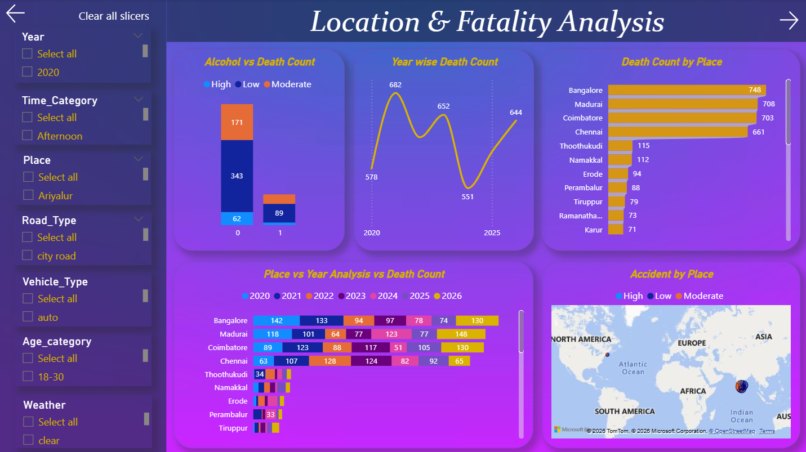
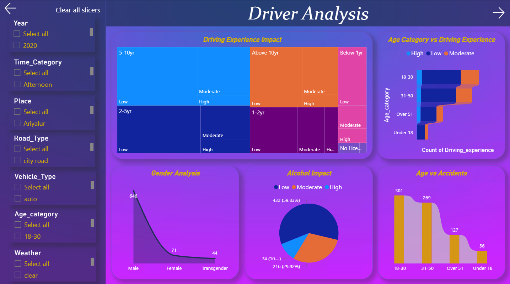
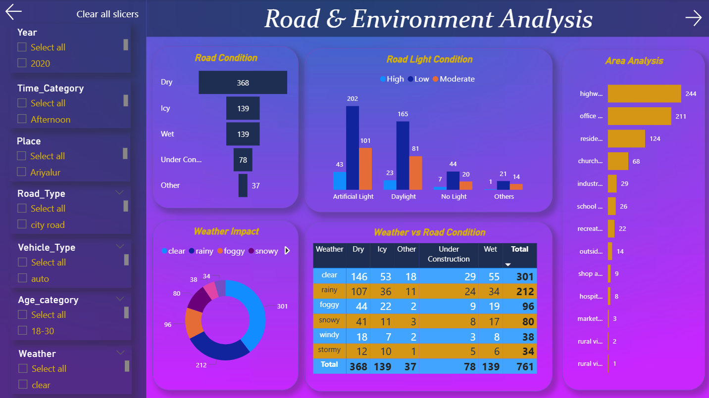
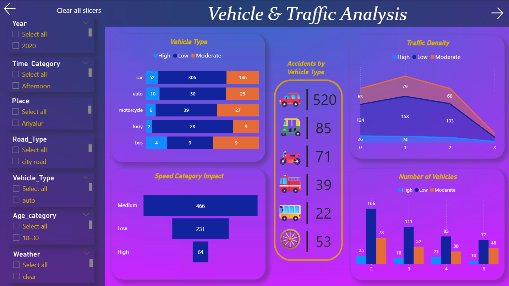
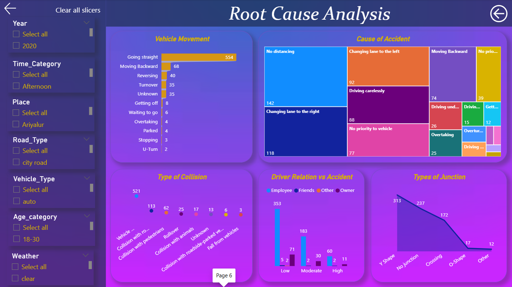
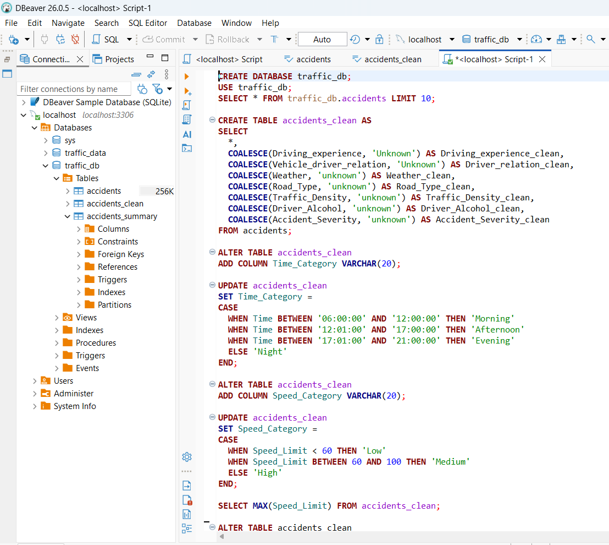
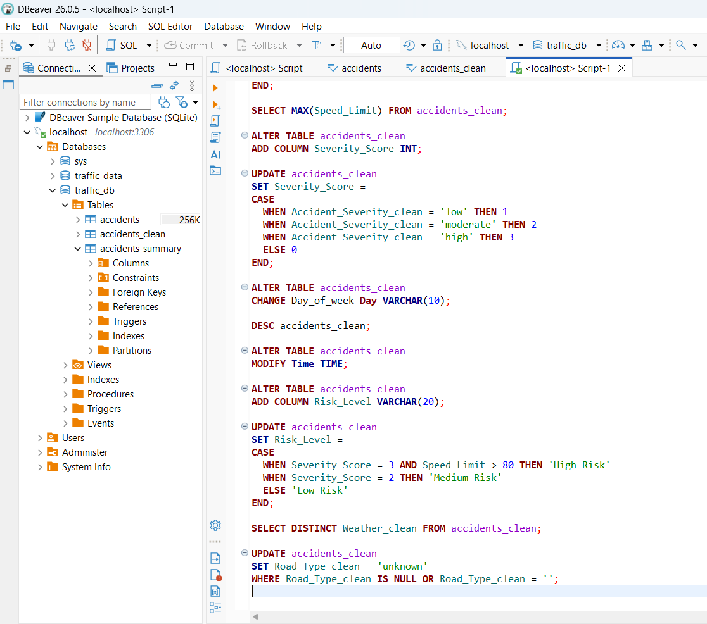

# Traffic-Accident-Analysis-Dashboard

## 📊 Overview
• Cleaned and transformed accident dataset using SQL (handling missing values, feature engineering)  
• Developed an interactive Power BI dashboard covering trends, driver behaviour, environmental factors and root causes 
• Generated actionable insights on accident patterns to support data-driven road safety decisions 

## 🚀 Key Features
- Accident trends by year, month, and time
- Analysis of driver behavior and accident causes
- Environmental factors (weather, road conditions)
- Severity and impact analysis of accidents

## 🛠 Tools Used
Power BI, DAX, SQL, Excel

## 📈 Insights
- Identified peak accident periods and high-risk time zones
- Analyzed major causes of accidents such as overspeeding and driver behavior
- Evaluated impact of weather and road conditions on accident frequency
- Provided insights to support road safety and preventive measures

## 📷 Dashboard Preview

## 📷 SQL Preview

## 📁 Files
- Traffic_Dashboard.pbix
- Traffic_dataset.xlsx
